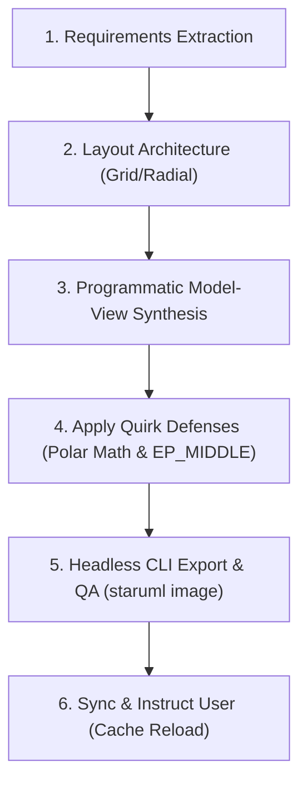

# StarUML Diagram Generator & Layout Engine

This skill guides you through systematically creating, programmatically generating, repairing, and validating clean, professional UML diagrams in StarUML (`.mdj` format) that adhere to academic lab requirements and production software engineering standards.

---

## Quick Reference & Helper Links

- **Internal JSON Structure**: [StarUML .mdj Schema Reference](./references/staruml_mdj_schema.md)
- **Math & Layout Quirks**: [Geometry & Polar Layout Rules](./references/geometry_and_layout_rules.md)
- **Academic Standards**: [The 9 Standard UML Diagrams Reference](./references/nine_uml_diagrams_standards.md)
- **Scripts**:
  - [staruml_utils.py](./scripts/staruml_utils.py) - ID generator, deep view cloner, polar math.
  - [build_communication_diagram.py](./scripts/build_communication_diagram.py) - Standalone CLI generator with zero-overlap geometry.
  - [export_and_verify.py](./scripts/export_and_verify.py) - Headless CLI export & visual inspection.
- **Examples**:
  - [sample_communication_spec.json](./examples/sample_communication_spec.json) - Input spec schema.
  - [collaboration_template.mdj](./examples/collaboration_template.mdj) - Base view template.

---

## Standard 6-Step Workflow

Follow this procedure sequentially to generate any StarUML diagram:



---

### Step 1: Requirements & Domain Entity Extraction

1. Read the system description, SRS, or problem context (e.g., `project_context.md`).
2. Identify:
   - **Actors & Boundaries**: Who interacts with the system? (Use Case)
   - **Classes & Types**: Data models, entities, attributes, methods. (Class & Object)
   - **Lifelines & Chronology**: Interacting subsystems and message orders. (Sequence & Collaboration)
   - **Lifecycle States**: Steady states and transitions for core business entities. (Statechart)
   - **Workflows & Concurrency**: Fork/join and decision branching. (Activity)
   - **Architecture**: Modules, APIs, physical nodes, devices, and protocols. (Component & Deployment)
3. Ensure cross-diagram consistency according to [The 9 Standard UML Diagrams](./references/nine_uml_diagrams_standards.md).

---

### Step 2: Choose Layout Architecture

**Never rely on StarUML's built-in auto-layout.** It produces tangled lines and ignores message geometry. Use one of these patterns:

1. **3x3 Deterministic Grid** *(Best for Collaboration, Class, Component diagrams)*:
   - Fixed box dimensions: `width = 180`, `height = 65`.
   - Col 1: $X = 220$ | Col 2: $X = 870$ | Col 3: $X = 1520$ ($\Delta X = 650\text{px}$).
   - Row 1: $Y = 100$ | Row 2: $Y = 450$ | Row 3: $Y = 800$ ($\Delta Y = 350\text{px}$).
2. **Layered / Hierarchical** *(Best for Activity and Statechart diagrams)*:
   - Vertical top-to-bottom flow: $\Delta Y = 120\text{px} - 160\text{px}$.
3. **Timeline Grid** *(Sequence diagrams)*:
   - Horizontal spacing between lifelines: $220\text{px} - 280\text{px}$.
   - Vertical step per message: $\Delta Y = 40\text{px} - 55\text{px}$.

---

### Step 3: Programmatic Model & View Synthesis

Because StarUML files contain hundreds of interconnected IDs, write a Python builder script instead of crafting JSON by hand.

Use the utilities in [staruml_utils.py](./scripts/staruml_utils.py):
1. **Generate 22-char IDs**:
   ```python
   from staruml_utils import get_id, clone_view
   new_id = get_id() # e.g. "AAAAAAF..."
   ```
2. **Clone Views from Templates**:
   Do not build complex nested view compartments from scratch. Deep-clone a valid template view from an existing `.mdj`:
   ```python
   view = clone_view(template_view, new_view_id, diagram_id, model_id)
   view["left"] = x
   view["top"] = y
   ```
3. **Bind Models and Views**:
   - Semantic element added to `interaction["ownedElements"]` or `model["ownedElements"]`.
   - Visual view added to `diagram["ownedViews"]` with `"model": {"$ref": model_id}`.

---

### Step 4: Apply StarUML Geometry & Quirk Defenses

Review [Geometry & Polar Layout Rules](./references/geometry_and_layout_rules.md) for complete details.

#### A. The `edgePosition: 1` Rule
For any `UMLCommMessageView` (Collaboration Diagram):
```python
view["edgePosition"] = 1  # 1 = EP_MIDDLE (Center of connector line)
```
*Omitting this defaults to `0` (`EP_HEAD`), clamping all arrows into the destination box corner.*

#### B. The Opaque Label Mask Trap & 4-Quadrant Separation
StarUML fills an opaque white rectangle behind label text. If multiple messages share a link, place them in distinct polar quadrants:
- **Upper-left**: `alpha = -2.094395` ($-120^\circ$), `distance = 65`, `lbl_alpha = 3.141592`, `lbl_dist = 80`
- **Upper-right**: `alpha = -1.047198` ($-60^\circ$), `distance = 65`, `lbl_alpha = 3.141592`, `lbl_dist = 85`
- **Lower-left**: `alpha = 2.094395` ($+120^\circ$), `distance = 65`, `lbl_alpha = 0.0`, `lbl_dist = 65`
- **Lower-right**: `alpha = 1.047198` ($+60^\circ$), `distance = 65`, `lbl_alpha = 0.0`, `lbl_dist = 80`

#### C. Inverted Canvas Y-Axis
Remember:
- `+90°` ($+1.570796$) points **DOWN**.
- `-90°` ($-1.570796$) points **UP**.

---

### Step 5: Headless CLI Compilation & Visual QA

Always verify diagram quality headlessly before presenting it to the user.

1. Run export via CLI:
   ```bash
   python3 .agents/skills/staruml-diagram-generator/scripts/export_and_verify.py <diagram.mdj> -o <output.png>
   ```
   Or directly:
   ```bash
   staruml image <diagram.mdj> -o <output.png>
   ```
2. Inspect the rendered image for:
   - [ ] No connector lines intersecting through middle node boxes.
   - [ ] No text label overlapping any arrow or other text.
   - [ ] Correct arrow line styles (synchronous solid arrow vs reply dashed arrow).
   - [ ] Legible font sizes and balanced padding.

---

### Step 6: StarUML Desktop App Memory Cache Handling

> [!IMPORTANT]
> The StarUML desktop GUI caches projects in memory and **does not hot-reload disk modifications**.
> When you update an `.mdj` file on disk:
> 1. Advise the user to reload the file in StarUML (`File -> Open...` or press `Ctrl+O`).
> 2. Present the exported PNG/JPG preview artifact so they can immediately see the clean result.
